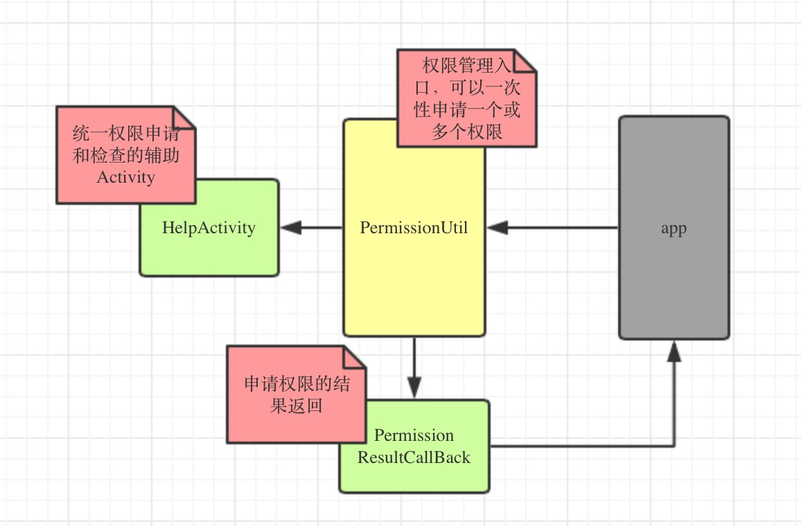

# PermissionUtil

  
 
## API 
###### 检查单个权限是否被允许
```JAVA
PermissionUtil.getInstance().checkSinglePermission(String permission)
```
###### 检查多个权限的状态,不会进行权限的申请
```JAVA
PermissionUtil.getInstance().checkMultiPermissions(String... permissions)
```
###### 用于fragment中请求权限
```JAVA
PermissionUtil.getInstance().request(Fragment fragment, String[] permissions, PermissionResultCallBack callBack)
PermissionUtil.getInstance().request(Fragment fragment, String[] permissions, PermissionOriginResultCallBack callBack) {
```
###### 用于activity中请求权限
```JAVA
PermissionUtil.getInstance().request(Activity activity, String[] permissions, PermissionResultCallBack callBack)
PermissionUtil.getInstance().request(Activity activity, String[] permissions, PermissionOriginResultCallBack callBack) {
```
###### 申请权限方法
```JAVA
PermissionUtil.getInstance().request(String[] permissions, PermissionResultCallBack callBack)
PermissionUtil.getInstance().request(String[] permissions, PermissionOriginResultCallBack callBack) {
```
###### 申请权限结果返回
```JAVA
PermissionUtil.getInstance().onRequestPermissionResult(int requestCode, String[] permissions, int[] grantResults)
```
## Example
```JAVA
PermissionUtil.getInstance().request(new String[]{Manifest.permission.CAMERA, Manifest.permission.READ_CONTACTS, Manifest.permission.READ_SMS},
    new PermissionResultCallBack() {
        void onPermissionGranted();
        void onPermissionGranted(String... permissions);
        void onPermissionDenied(String... permissions);
        void onRationalShow(String... permissions);
    });
```
可以通过PermissionResultCallBack获得回调的结果,也可以通过PermissionResultAdapter获得回调的结果,区别是 PermissionResultAdapter支持任意重写方法,而无需重写所有的方法.
```JAVA
PermissionUtil.getInstance().request(new String[]{Manifest.permission.READ_CALENDAR}, mRequestCode,
    new PermissionResultAdapter() {
        @Override
        public void onResult(Map<String, List<PermissionInfo>> result) {

        }
    });
```
另外如果通过此方法进行调用,结果的返回也可以通过activity或者fragment的onRequestPermissionsResult得到结果

## Attension

只能在主线程中调用,建议不要在Service或Broadcast中使用,因为逻辑是通过获取当前程序的activity栈中的顶层activity进行请求的.